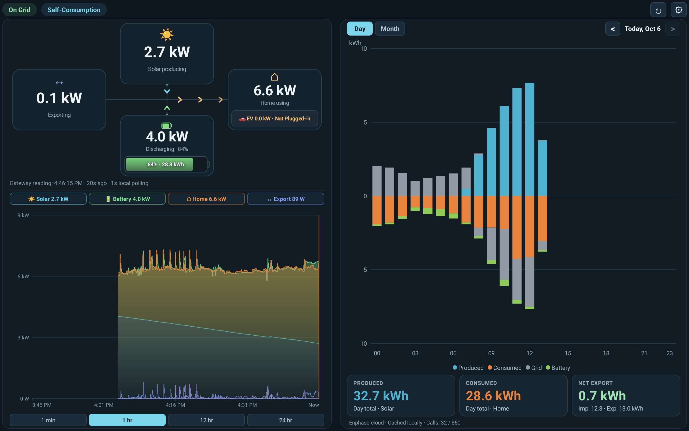

# EnphaseLive

[-3DDC84?logo=android&logoColor=white)](https://developer.android.com)
[](https://kotlinlang.org)
[](LICENSE)
[]()

**EnphaseLive** is an open-source, high-performance native Android dashboard designed for wall-mounted tablets (such as the Google Pixel Tablet) and dedicated displays to monitor your Enphase solar energy system in real time.



---

## Highlights

- **100% Native Kotlin & Canvas Graphics**: Fluid 60 FPS rendering with zero WebViews or third-party bloated chart dependencies. Hardware-accelerated canvas drawing with zero heap allocation in render loops.
- **1-Second Real-Time Telemetry**: Connects directly to your local Enphase IQ Gateway (Envoy) over your home network (LAN). Never dependent on cloud uptime for real-time status.
- **Sense-Inspired Real-Time Area Chart**:
  - Stepped shaded area visualization inspired by Sense app aesthetics.
  - Stacks Solar Generation and Battery Discharge as total produced energy for effortless comparison against Home Consumption and Grid Import/Export.
  - High-resolution local history buffer storing up to 24 hours of 1-second telemetry with sub-millisecond ring-buffer pruning and binary disk persistence.
  - Quick range selector: **1m**, **1h**, **12h**, and **24h**.
  - Interactive clickable badge filters (**Solar**, **Battery**, **Home**, **Grid**) to show or hide individual series dynamically.
  - Interactive touch scrubber displaying exact wattage per stream at any point in time.
- **Dynamic Energy Flow Diagram**:
  - Four enlarged live activity blocks: **Solar Producing**, **Grid Importing/Exporting**, **Home Using**, and **Battery Charging/Discharging**.
  - Directional animated energy flow links indicating live power routing.
  - Smart grid threshold: suppresses grid animation for minor fluctuations below 1.0 kW while continuing to report precise measurements.
  - Physical horizontal battery gauge with casing, terminal nub (+), and smooth three-color gradient (Red &lt;20%, Amber 20-50%, Green &gt;50%) with overlaid SoC% and remaining kWh.
  - Integrated EV Charger status badge inside the Home block (Standby, Charging, or Unplugged).
- **Historical Energy Analytics**:
  - Stacked hourly (Day view) and daily (Month view) bar charts powered by the Enphase Cloud API v4.
  - Touch interactive tooltip showing production, consumption, and net export/import.
  - Smart multi-tier disk caching: completed prior days/months are cached permanently to strictly respect the 1,000 req/month free API tier (with a default 850 request safety cap).
- **Designed for Wall Displays**:
  - Immersive sticky full-screen mode hides navigation and status bars.
  - `FLAG_KEEP_SCREEN_ON` ensures uninterrupted visibility on docks and wall mounts.
  - Real-time battery profile pill reflects live gateway storage settings (*Self-Consumption*, *Full Backup*, *Savings*, or *AI-Optimized*).
- **Privacy & Security First**:
  - **Zero cloud telemetry or third-party trackers**: all data stays between your tablet, your local gateway, and your own Enphase account.
  - **Hardware-Backed Encryption**: All tokens and API keys are stored encrypted using Android Keystore AES-GCM in the device's `noBackupFilesDir`.
  - **Universal Gateway Support**: Configurable Gateway Host/IP (`envoy.local` or custom IP) with Trust-on-First-Use (TOFU) SHA-256 certificate pinning to protect against LAN MITM attacks while supporting any Enphase Gateway out of the box.

---

## Requirements

- **Device**: Android tablet or phone running **Android 8.0 (API level 26)** or higher (tested on Google Pixel Tablet, Android 13/14/15).
- **Network**: The Android device must be on the same local network (Wi-Fi or Ethernet) as the Enphase IQ Gateway.
- **Enphase System**:
  - IQ Gateway / Envoy running firmware D7.x or D8.x.
  - Local Gateway owner token (generated via Enphase Enlighten or `entrez.enphaseenergy.com`).
  - *(Optional)* Enphase Cloud API v4 credentials for historical Day/Month bar charts and EV charger status.

---

## Getting Started

### 1. Installation

Download the latest release APK from the [Releases](../../releases) page, or build it from source:

```bash
git clone https://github.com/your-username/EnphaseLive.git
cd EnphaseLive
./gradlew assembleRelease
adb install -r app/build/outputs/apk/release/app-release-unsigned.apk
```

### 2. Local Gateway Setup

1. Open **EnphaseLive** on your tablet.
2. Tap the **Settings (⚙)** icon in the upper-right corner.
3. Select **Configure Gateway Host**:
   - By default, `envoy.local` is used. If your local router does not support mDNS, enter your gateway's static or DHCP reservation IP (e.g., `192.168.1.150`).
4. Select **Enter / Replace Gateway Token**:
   - Generate an Envoy token from [entrez.enphaseenergy.com](https://entrez.enphaseenergy.com) or via your Enlighten account.
   - Paste either the raw JWT token (`ey...`) or the entire JSON response into the prompt.
   - The token will be encrypted in the hardware Android Keystore and saved securely.
5. The live energy flow diagram and real-time power chart will begin streaming immediately!

### 3. (Optional) Enphase Cloud History Setup

To enable the historical Day/Month energy charts and EV charger telemetry:

1. Register a free developer account at [developer.enphase.com](https://developer.enphase.com) and create an **API v4 application**.
2. Tap **Settings (⚙)** → **Configure Enphase Cloud API**.
3. Enter your **API Key**, **Client ID**, and **Client Secret**. (System ID is auto-discovered if left blank).
4. Tap **Save**. Cloud history will be fetched and cached automatically.

---

## Building from Source

### Prerequisites
- JDK 17
- Android SDK 35 (Build Tools 35.0.0)

### Commands

```powershell
# Run unit tests
./gradlew testDebugUnitTest

# Run Android Lint
./gradlew lintDebug

# Build Debug APK
./gradlew assembleDebug

# Build ProGuard Minified Release APK
./gradlew assembleRelease
```

---

## Architecture Overview

```
app/src/main/java/com/saver/enphaselive/
├── MainActivity.kt          # Main display orchestrator, UI layout, lifecycle & settings dialogs
├── GatewayClient.kt         # HTTPS client with configurable host, Bearer auth & TOFU cert pinning
├── CloudClient.kt           # Enphase Cloud API v4 client, rate limiter & disk response cache
├── TokenStore.kt            # Android Keystore AES-GCM encrypted gateway token storage
├── SecureJsonStore.kt       # Android Keystore AES-GCM encrypted cloud credential store
├── RealtimeDataStore.kt     # High-resolution 24h telemetry buffer, downsampling & async persistence
├── RealtimeChartView.kt     # Sense-inspired real-time canvas area chart with interactive scrub & filters
├── EnergyFlowView.kt        # Canvas energy flow diagram, dynamic arrows & physical battery gauge
├── HistoryChartView.kt      # Stacked day/month historical bar chart with canvas tooltip overlay
└── HistoryParser.kt         # Telemetry interval normalizer for cloud responses
```

---

## License

Distributed under the MIT License. See [`LICENSE`](LICENSE) for more information.
